# Mockup and wireframes

## Mockup

This here is the V2 mockup. This was the original plan for the app. The app changed a lot based on looking at the current build.

## Wireframes

This here is the wireframe from prelim. There were some changes such as the inclusion of a nav bar in the midterm mockup and final build of the app. The lack of arrows is due to my personal belief that the wireframe is very straightforward enough. And because the app itself will have the option of being usable irregardless of which order of screens you go to.

The way the app works is either through a sequence or based on what the user selects.
When in sequence, the app follows this: Home -> Ratio Calculator -> Grind settings -> Stopwatch -> Notes.
When based on the user, anything goes.

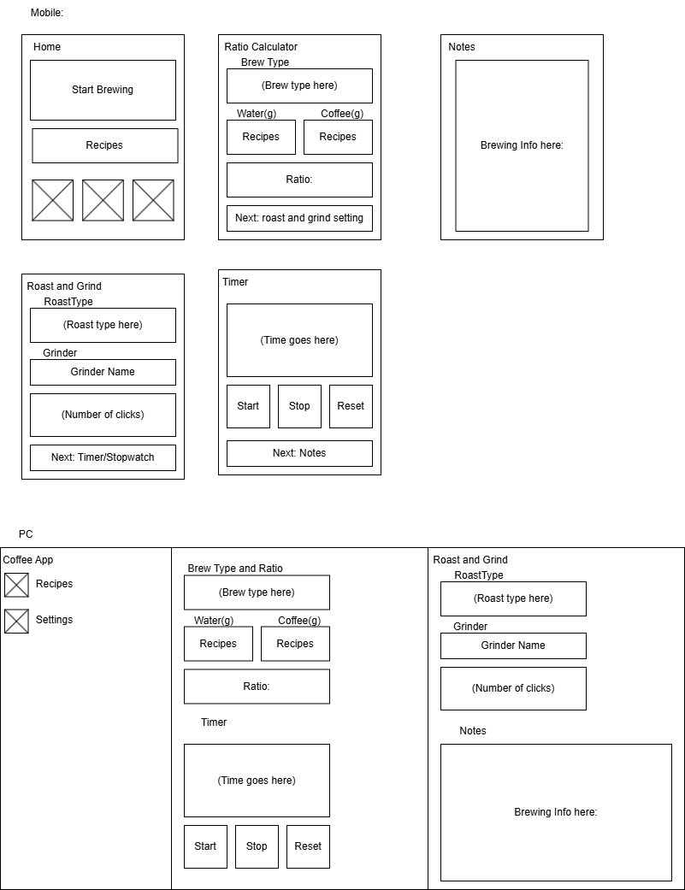

## Screens

As stated before, the app either works in a sequence or based on which screen the user fancies.
A nav bar is present in all screens and have the following: Home, Ratio Calculator, Grind Settings, Stopwatch, and Notes. This is to make traversing easier, especially with the lack of a back button, which in hindsight, the mockup never had either.

### 1. Home

This is the first screen. It has a Start Brewing button, a bit of text for help underneath it, and four tool cards/buttons: Ratio Calculator, Brew Stopwatch, Grind Setting, and Notes.

- **Start Brewing** clears any old values and opens the Calculator in sequence.
- A **tool card** opens that tool on its own.
- The **nav bar** opens the matching screen.

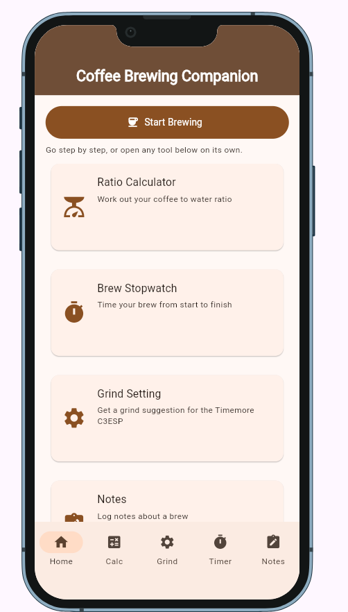

### 2. Calculator

The user picks a brew method from a dropdown: Moka Pot, French Press, or Cold Brew. They enter coffee in grams and a ratio, which starts at 15. A result card shows the water and coffee amounts and a strength badge.

- **Next: Grind Setting** opens Grind. It shows only in a sequence, and only once there is a result.
- The **nav bar** opens any screen.

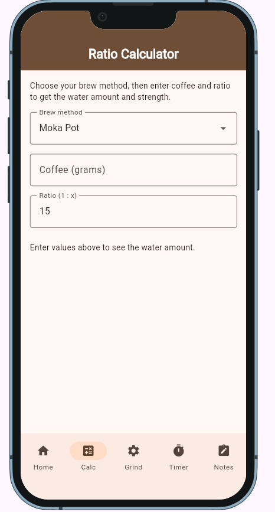
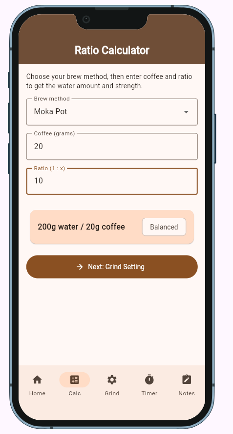

### 3. Grind Setting

The user picks a roast type, being Medium or Dark. A result card shows the suggested click settings for the Timemore C3ESP grinder. When not in sequence, the screen also has a brew method dropdown. When in a sequence, the method from the Calculator is shown as text instead. The app remembers the brew setting from the ratio calculator screen.

- **Next: Timer** opens the Timer. It shows only in a sequence.
- The **nav bar** opens any screen.

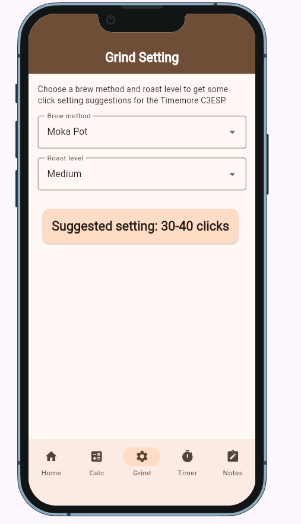
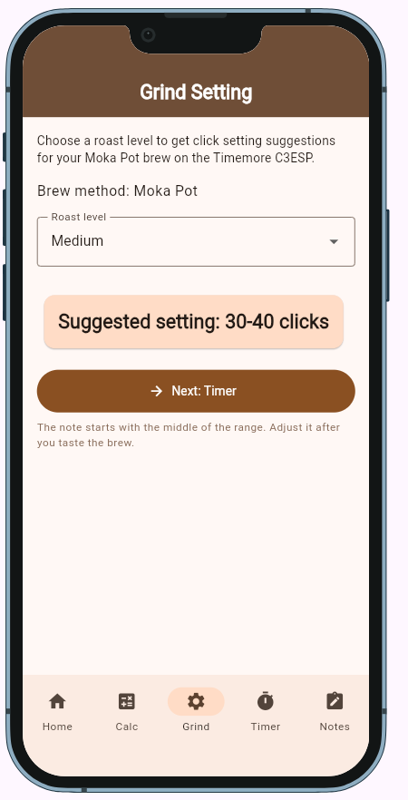

### 4. Timer

A large time readout with Start, Stop, and Reset buttons. It counts up as a stopwatch.

- **Next: Notes** opens a new note with the earlier values filled in. It shows only in a sequence, and only after the user stops a timed brew.
- The **nav bar** opens any screen.

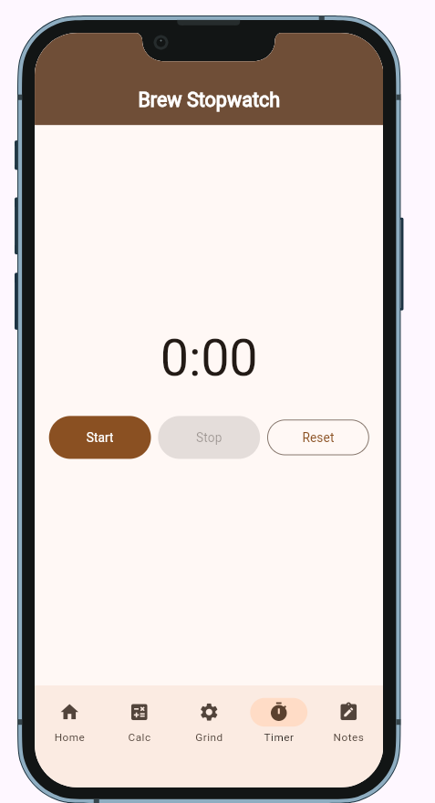
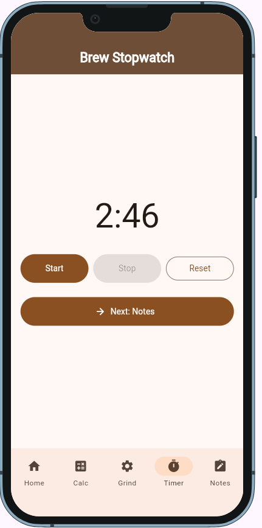

### 5. Notes

A list of saved brew notes, with the most recent being the first on top. Each one shows the method, ratio, roast, clicks, strength, and taste notes. An empty list shows a short message.

- The **+ button** opens the New Brew Note dialog. It has fields for method, roast, coffee, water, grind clicks, brew time, temperature, and taste notes. After a sequence, the dialog opens by itself with the earlier values filled in.
- **Save** stores the note in the list. Cancel closes the dialog.
- The **nav bar** opens any screen.

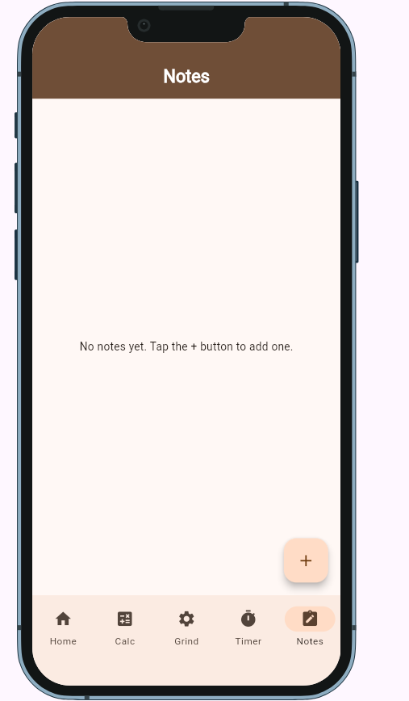
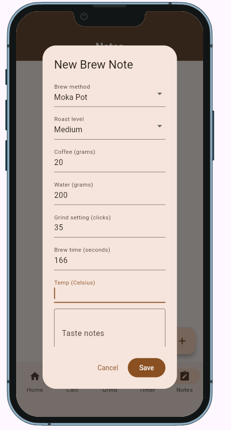
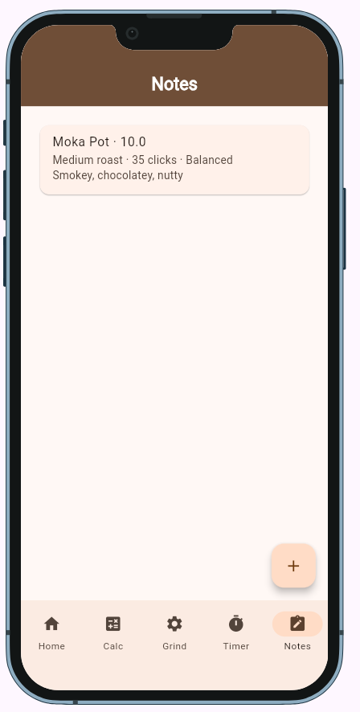

## What changed from the mockup
 
| Area | V2 mockup | Final app |
| --- | --- | --- |
| Nav bar | Calc, Notes, Timer, Settings | Home, Calc, Grind, Timer, Notes, in one shared screen |
| Home | Start Brewing and recent recipe cards | Start Brewing and four tool cards |
| Calculator | Water and coffee in grams | Coffee in grams and a ratio |
| Roast + Grind | One screen with a grinder dropdown | Grind Setting, with the grinder fixed to the Timemore C3ESP |
| Buttons | Start Timer, Save & Continue, Save | Next buttons in a sequence only |
| Saving | Every guided run ends in a saved note | Notes are added from a sequence or from the + button on Notes |
